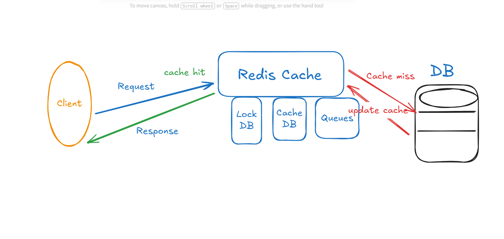

# 🚀 High-Concurrency Stock Reservation System  

A Laravel 12 system implementing **atomic stock holds**, **race-condition safety**, **Redis locks**, **cache-aside**, and **queue-based hold expiry**.

---

## 🏷️ Badges


---

## 🎨 Design

Below is the visual design for the flash sale checkout system:



---

## 🧰 Tech Stack

- **Laravel 12**
- **MySQL (InnoDB)**
- **Redis Cache**
- **Redis Locks**
- **Queue Worker for hold expiry**

---

## ⚙️ Installation

### 1. Install Dependencies
```bash
composer install
cp .env.example .env
php artisan key:generate
php artisan migrate
php artisan db:seed   # seeds products
```

### 2. Installing Redis

#### Windows
```bash
wsl --install
```

#### Linux
```bash
sudo apt update
sudo apt install redis-server -y
```

#### Start Redis
```bash
sudo service redis-server start
```

#### Test Redis
```bash
redis-cli ping   # Should return: PONG
```

---

## ▶️ Start Services

### Run API
```bash
php artisan serve
```

### Run Queue Worker
```bash
php artisan queue:work
```

### Run Tests
```bash
php artisan test
```

---

## 🧩 System Invariants

### 📊 Stock Quantity Updates Occur In:

1. Creating a hold
2. Releasing expired hold
3. Cancelling a failed payment

### 🔒 Race-Condition Safety Implemented Using:

1. Redis Caching Locks + MySQL Pessimistic Lock
2. DB Transactions

### ⏱️ Hold Lifetime

- Fixed duration: **2 minutes**

### ⚡ Read Performance

1. Cache-Aside pattern with Redis
2. Cache invalidated on writes

---

## 📡 API Endpoints

| Method | Endpoint | Description |
|--------|----------|-------------|
| `GET` | `/api/products/{id}` | Fetch product and stock |
| `POST` | `/api/holds/{product_id}/{quantity}` | Create a temporary stock reservation |
| `POST` | `/api/orders/{hold_id}/{product_id}` | Create order based on active hold |
| `POST` | `/api/payments/webhook` | Payment success/failure callback |

---

## 📋 Example Responses

### GET `/api/products/{id}`
```json
{
  "id": 1,
  "price": 200,
  "stock": 4
}
```

### POST `/api/holds/{product_id}/{quantity}`
```json
{
  "message": "Holded Successfully",
  "success": true,
  "hold": {
    "id": 2,
    "qty": 2,
    "expires_at": "2025-01-01T12:00:00Z"
  }
}
```

### POST `/api/orders/{hold_id}/{product_id}`
```json
{
  "message": "order created successfully",
  "success": true,
  "order": {
    "status": "pending_payment",
    "hold_id": 13,
    "updated_at": "2025-12-02T14:47:04.000000Z",
    "created_at": "2025-12-02T14:47:04.000000Z",
    "id": 19
  }
}
```

### POST `/api/payments/webhook`
```json
{
  "message": "ok"
}
```

---
